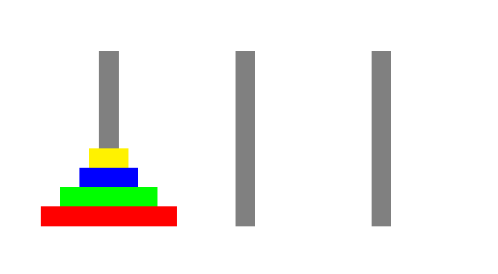

Examples
++++++++

In this section we show how to use ASPECT syntax in various problems typical of the ASP context.

.. _examples-github: https://github.com/abertagnon/aspect/tree/main/examples

.. note::
   More examples are available in the `GitHub <examples-github_>`_ repository.

Graph Coloring
^^^^^^^^^^^^^^

Graph coloring is a well-known problem that is often used as an example to introduce answer
set programming to students. *The problem consists of assigning colors to vertices of a graph
such that two adjacent vertices do not share the same color.*

The ASP encoding of the problem consists of ``node(N)`` atoms to denote the nodes of the graph 
where ``N`` is an index that identifies the node. Also part of the encoding are ``arc(A,B)`` atoms 
indicating the edges of the graph and ``color(N,Color)`` atoms indicating the colour associated
with each vertex.

.. code-block:: prolog

    node(0..5).

    col(yellow). col(orange). col(green). col(cyan).

    edge(0, 1). edge(0, 3). edge(0, 2). edge(0, 4). edge(0, 5).
    edge(1, 3). edge(1, 4).
    edge(2, 3).
    edge(3, 4). edge(3, 5).

    1 {color(X, C): col(C)} 1 :- node(X).
    :- edge(X, Y), col(C), color(X, C), color(Y, C).

In this problem the coordinates of the various nodes in the graph are not important so it is easier 
to visualize the solutions using the :doc:`graph atoms </options/language>`.
The ASPECT code required for the visualization is given below.

.. code-block:: prolog

    aspect_graphcolornode(X,Color,circle) :- color(X,Color).
    aspect_graphdrawline(A,B) :- edge(A,B).

.. tip:: 
    To try this example (using `clingo <https://potassco.org/clingo/>`_ as ASP solver) run the following command:

    .. code-block:: bash

        clingo ./examples/01-graph-coloring/graph.lp | java -jar ASPECT.jar

    If you want to draw 5 solutions use:

    .. code-block:: bash

        clingo ./examples/01-graph-coloring/graph.lp 5 | java -jar ASPECT.jar

    If you want the 5 solutions drawn in a single beamer presentation try:

    .. code-block:: bash

        clingo ./examples/01-graph-coloring/graph.lp 5 | java -jar ASPECT.jar --beamer

    the result in this last case is better by also setting the resize parameter 

    .. code-block:: bash

        clingo ./examples/01-graph-coloring/graph.lp 5 | java -jar ASPECT.jar --beamer --resize 0.5
    

.. figure:: ../_static/images/graph_coloring.png
    :width: 50%
    :align: center
    
    Graph coloring solution generated with ASPECT graph mode.

N-queens Problem
^^^^^^^^^^^^^^^^

*The N-queens problem is a classic puzzle that involves placing N chess queens on an N x N
chessboard such that no two queens threaten each other: so, no pair of queens should share
the same row, column, or diagonal. The challenge is to find a solution for any given value of N.*

We use an ASP encoding where the chessboard is described with an atom
``grid(I,J)`` for all the possible squares of the board, while the solution has an atom ``queen(R,C)``
indicating each queen positioned on the board.

.. code-block:: prolog

    #const n = 8.

    1 { queen(I, 1..n) } 1 :- I = 1..n.
    1 { queen(1..n, J) } 1 :- J = 1..n.

    :- 2 { queen(I,J) : D = I+J+1 }, D = 1..2*n-1.
    :- 2 { queen(I,J) : D = I-J+n }, D = 1..2*n-1.

The following two lines of ASPECT code draw the squares of the checkerboard, each with side length 2
and centered in (2I,2J). In particular, the first line set the background color to gray for half
of the squares to create the classic chequered pattern.

.. code-block:: prolog

    aspect_fillrectangle(2*I-1,2*J-1,2*I+1,2*J+1,gray):- I = 1..n, J = 1..n, I\2=J\2.
    aspect_drawrectangle(2*I-1,2*J-1,2*I+1,2*J+1):- I = 1..n, J = 1..n, I\2!=J\2.

In a similar fashion, we can draw the queens with:

.. code-block:: prolog

    aspect_imagenode(2*I,2*J,"./examples/02-n-queens/queen.png",50):- queen(I,J).

.. tip:: 
    To try this example (using `clingo <https://potassco.org/clingo/>`_ as ASP solver) run the following command:

    .. code-block:: bash

        clingo ./examples/02-n-queens/queens.lp | java -jar ASPECT.jar

    If you want to draw 10 solutions use:

    .. code-block:: bash

        clingo ./examples/02-n-queens/queens.lp 10 | java -jar ASPECT.jar

    If you want the 10 solutions drawn in a single beamer presentation try:

    .. code-block:: bash

        clingo ./examples/02-n-queens/queens.lp 10 | java -jar ASPECT.jar --beamer

    the result in this last case is better by also setting the resize parameter 

    .. code-block:: bash

        clingo ./examples/02-n-queens/queens.lp 10 | java -jar ASPECT.jar --beamer --resize 0.8

.. figure:: ../_static/images/n_queens_8x8.png
    :width: 50%
    :align: center
    
    N-queens problem (N = 8) solution generated with ASPECT.

Tower of Hanoi
^^^^^^^^^^^^^^

The Tower of Hanoi is a well known example of planning problem in computer science.
*The Tower of Hanoi involves three pegs and a number of disks of different sizes that can slide onto any peg.
The puzzle begins with the disks stacked on one peg in order of decreasing size, the smallest at the top.
The challenge is to move the initial stack of disks from one peg to another, for any given number of disks, while following some rules.*

* *Each move consists of taking the upper disk from a stack and placing it on top of another stack or an empty peg;*
* *A move involves the movement of only one disk at a time;*
* *It is not possible to place a disk on top of a smaller one.*

The ASP encoding of the problem includes an atom ``peg(P)`` for each peg and an atom ``disk(D)`` for each disk. 
Moves are encoded by atoms ``on(D,P,T)`` representing the fact that disc ``D`` is on peg ``P`` at time ``T``.
The complete ASP encoding can be found on `here <https://github.com/abertagnon/aspect/blob/main/examples/07-tower-of-hanoi/hanoi.lp>`_.

The graphic animation depicting the entire sequence of moves to solve the problem is possible with the following lines of code:

.. code-block:: prolog

    % draw pegs
    aspect_fillrectangle(X, 0, X+2, 18, gray) :- peg(P), peg_x(P, X).
   
    % draw disks
    disk_level(Count, D1, P, T) :- on(D1, P, T), #count { D2 : on(D2, P, T), disk(D2), D2 < D1} = Count.
    
    aspect_fillrectangle(X-Width, L*2, X+2+Width, (L*2)+2, Color, T+1) :- 
      on(D, P, T), peg(P), peg_x(P, X), disk_color(D, Color), disk_width(D, Width), disk_level(L, D, P, T).

Note that the rectangles representing the pegs do not include the ``frame`` parameter since they are intended to be present throughout the entire animation. 
On the other hand, the disks have the ``frame`` parameter, and it corresponds to the variable ``T`` of the ``on(D,P,T)`` atom.

The previous code also depends on the following atoms introducing information regarding the graphical appearance of the various elements.

.. code-block:: prolog

    disk_width(1, 6).
    disk_width(2, 4).
    disk_width(3, 2).
    disk_width(4, 1).
    disk_color(1, red).
    disk_color(2, green).
    disk_color(3, blue).
    disk_color(4, yellow).
    peg_x(a, 6).
    peg_x(b, 20).
    peg_x(c, 34).

.. tip:: 
    To try this example (using `clingo <https://potassco.org/clingo/>`_ as ASP solver) run the following command:

    .. code-block:: bash

        clingo ./examples/07-tower-of-hanoi/hanoi.lp | java -jar ASPECT.jar

    this encoding is with 4 disks, so 16 files representing the sequence of moves (15 moves + initial position) are generated.

    If you want the sequence drawn in a single beamer presentation try:

    .. code-block:: bash

        clingo ./examples/07-tower-of-hanoi/hanoi.lp | java -jar ASPECT.jar --beamer

    To generate JavaScript driven PDFs containing vector graphics in motion, you can use the animate mode:

    .. code-block:: bash

        clingo ./examples/07-tower-of-hanoi/hanoi.lp | java -jar ASPECT.jar --animate

    
    Sequence of moves to solve the Tower of Hanoi, with 4 disks (animated).

.. note::
   More examples are available in the `GitHub <examples-github_>`_ repository.