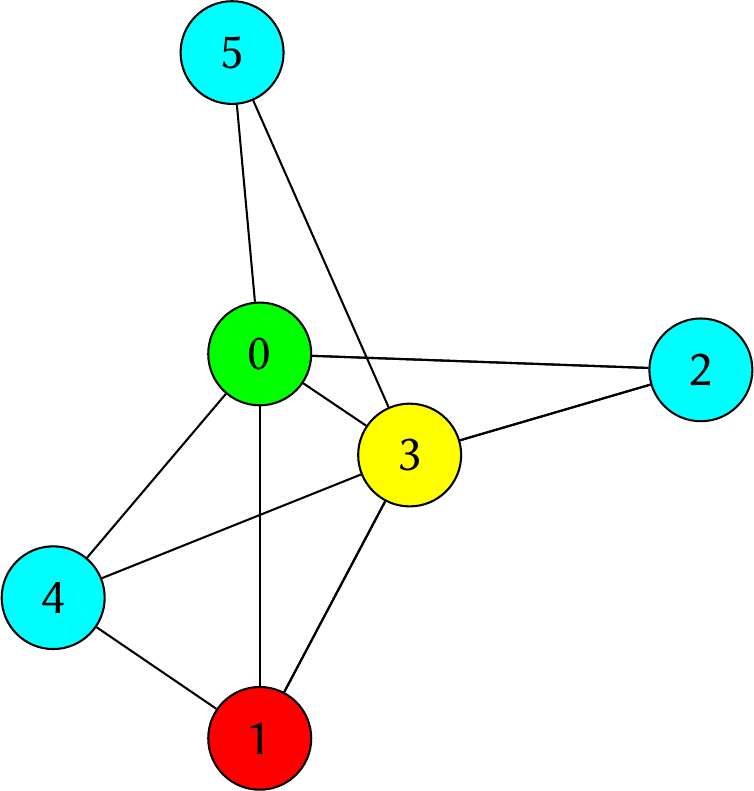
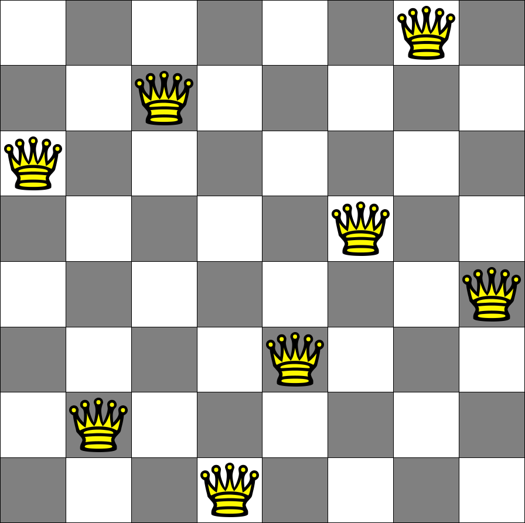

Examples
++++++++

In this section we show how to use ASPECT syntax in various problems typical of the ASP context.

Graph Coloring
^^^^^^^^^^^^^^

Graph coloring is a well-known problem that is often used as an example to introduce answer
set programming to students. *The problem consists of assigning colors to vertices of a graph
such that two adjacent vertices do not share the same color.*

The ASP encoding of the problem consists of ``node(N)`` atoms to denote the nodes of the graph 
where ``N`` is an index that identifies the node. Also part of the encoding are ``arc(A,B)`` atoms 
indicating the edges of the graph and ``colour(N,Color)`` atoms indicating the colour associated
with each vertex.

.. code-block:: prolog

    node(0..5).

    col(yellow). col(orange). col(green). col(cyan).

    edge(0, 1). edge(0, 3). edge(0, 2). edge(0, 4). edge(0, 5).
    edge(1, 3). edge(1, 4).
    edge(2, 3).
    edge(3, 4). edge(3, 5).

    1 {color(X, C): col(C)} 1 :- node(X).
    :- edge(X, Y), col(C), color(X, C), color(Y, C).

In this problem the coordinates of the various nodes in the graph are not important so it is easier 
to visualize the solutions using the :doc:`graph mode </options/modes>`.
The ASPECT code required for the visualization is given below.

.. code-block:: prolog

    aspect_colornode(X,Color) :- color(X,Color).
    aspect_drawline(A,B) :- edge(A,B).

.. tip:: 
    To try this example run the following command (note the use of the ``--graph`` option):

    .. code-block:: bash

        java -jar ASPECT.jar --graph ./examples/graph_coloring/graph.lp

    If you want to draw 5 solutions use:

    .. code-block:: bash

        java -jar ASPECT.jar --graph 5 ./examples/graph_coloring/graph.lp

    If you want the 5 solutions drawn in a single beamer presentation try:

    .. code-block:: bash

        java -jar ASPECT.jar --graph --free 5 ./examples/graph_coloring/graph.lp

    or

    .. code-block:: bash

        java -jar ASPECT.jar --graph --merge 5 ./examples/graph_coloring/graph.lp
    

    
    Graph coloring solution generated with ASPECT graph mode.

N-queens Problem
^^^^^^^^^^^^^^^^

*The N-queens problem is a classic puzzle that involves placing N chess queens on an N x N
chessboard such that no two queens threaten each other: so, no pair of queens should share
the same row, column, or diagonal. The challenge is to find a solution for any given value of N.*

We use an ASP encoding where the chessboard is described with an atom
``grid(I,J)`` for all the possible squares of the board, while the solution has an atom ``queen(R,C)``
indicating each queen positioned on the board.

.. code-block:: prolog

    #const n = 8.

    1 { queen(I, 1..n) } 1 :- I = 1..n.
    1 { queen(1..n, J) } 1 :- J = 1..n.

    :- 2 { queen(I,J) : D = I+J+1 }, D = 1..2*n-1.
    :- 2 { queen(I,J) : D = I-J+n }, D = 1..2*n-1.

The following two lines of ASPECT code draw the squares of the checkerboard, each with side length 2
and centered in (2I,2J). In particular, the first line set the background color to gray for half
of the squares to create the classic chequered pattern.

.. code-block:: prolog

    aspect_fillrectangle(2*I-1, 2*J-1, 2*I+1, 2*J+1, gray) :- grid(I, J), I\2 = J\2.
    aspect_drawrectangle(2*I-1, 2*J-1, 2*I+1, 2*J+1) :- grid(I, J), I\2 != J\2.

In a similar fashion, we can draw the queens with:

.. code-block:: prolog

    aspect_imagenode(2*I, 2*J, "./examples/n_queens/queen.png", 50) :- queen(I, J).

.. tip:: 
    To try this example run the following command:

    .. code-block:: bash

        java -jar ASPECT.jar ./examples/n_queens/queens.lp

    If you want to draw 10 solutions use:

    .. code-block:: bash

        java -jar ASPECT.jar 10 ./examples/n_queens/queens.lp

    If you want the 10 solutions drawn in a single beamer presentation try:

    .. code-block:: bash

        java -jar ASPECT.jar --free 10 ./examples/n_queens/queens.lp

    or

    .. code-block:: bash

        java -jar ASPECT.jar --merge 10 ./examples/n_queens/queens.lp

    
    N-queens problem (N = 8) solution generated with ASPECT.