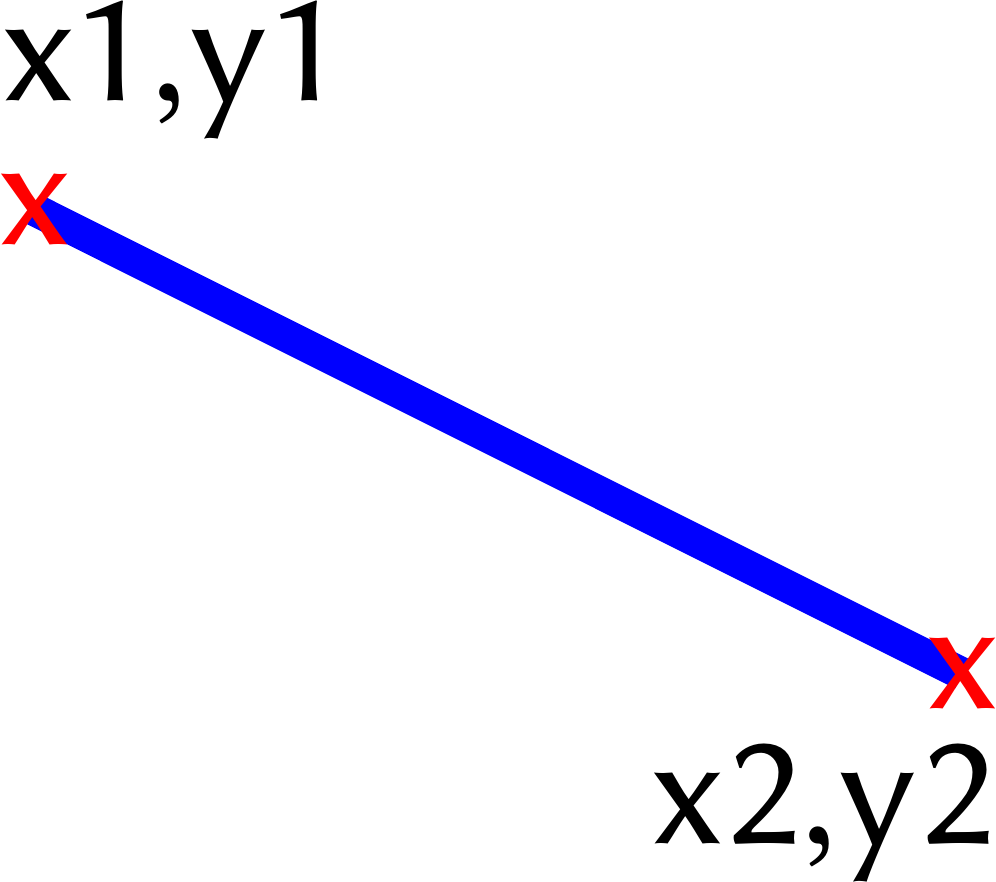
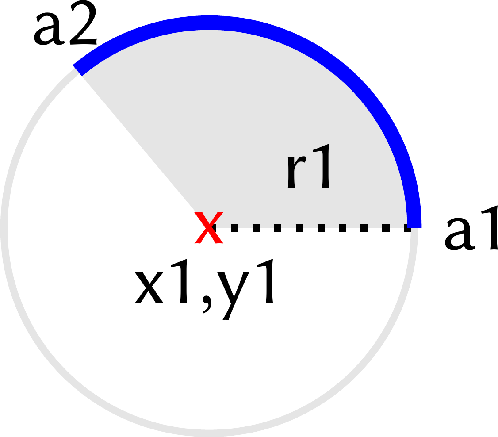
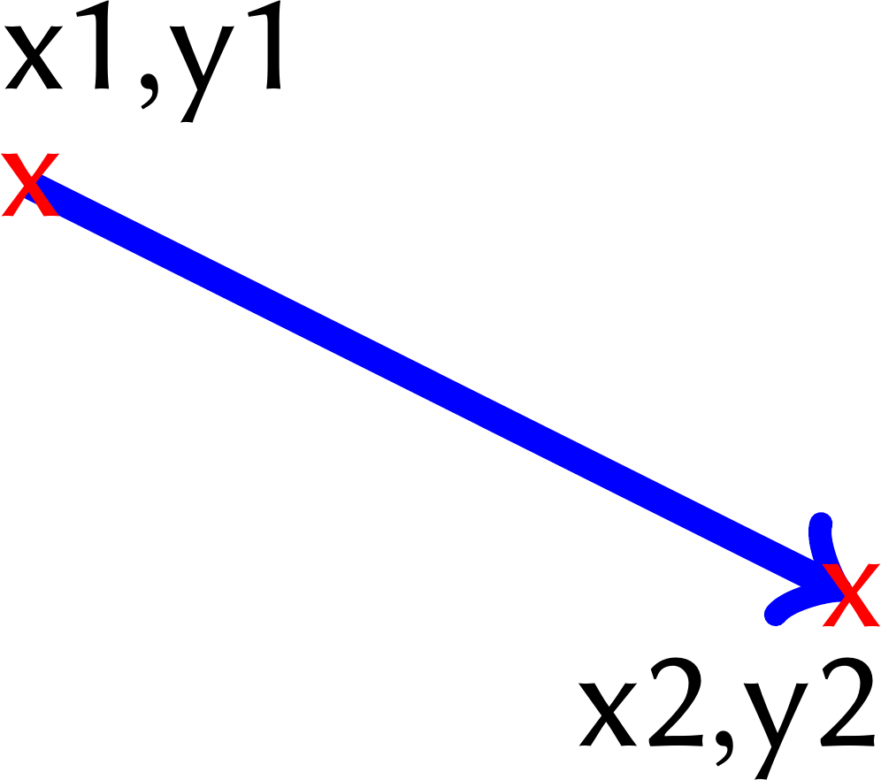
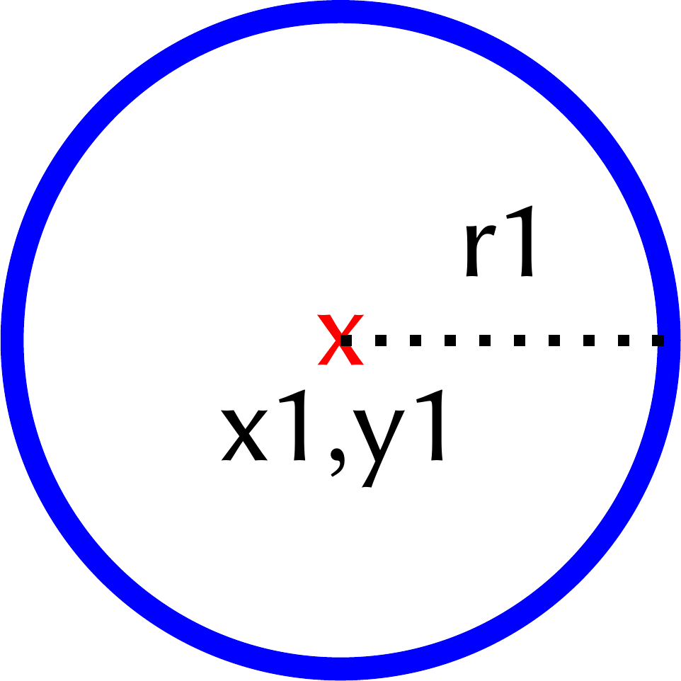
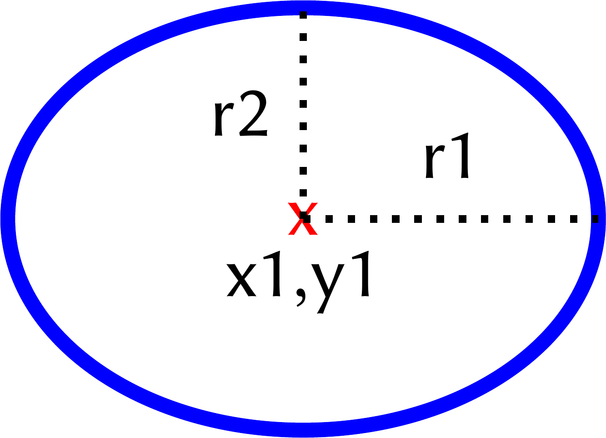
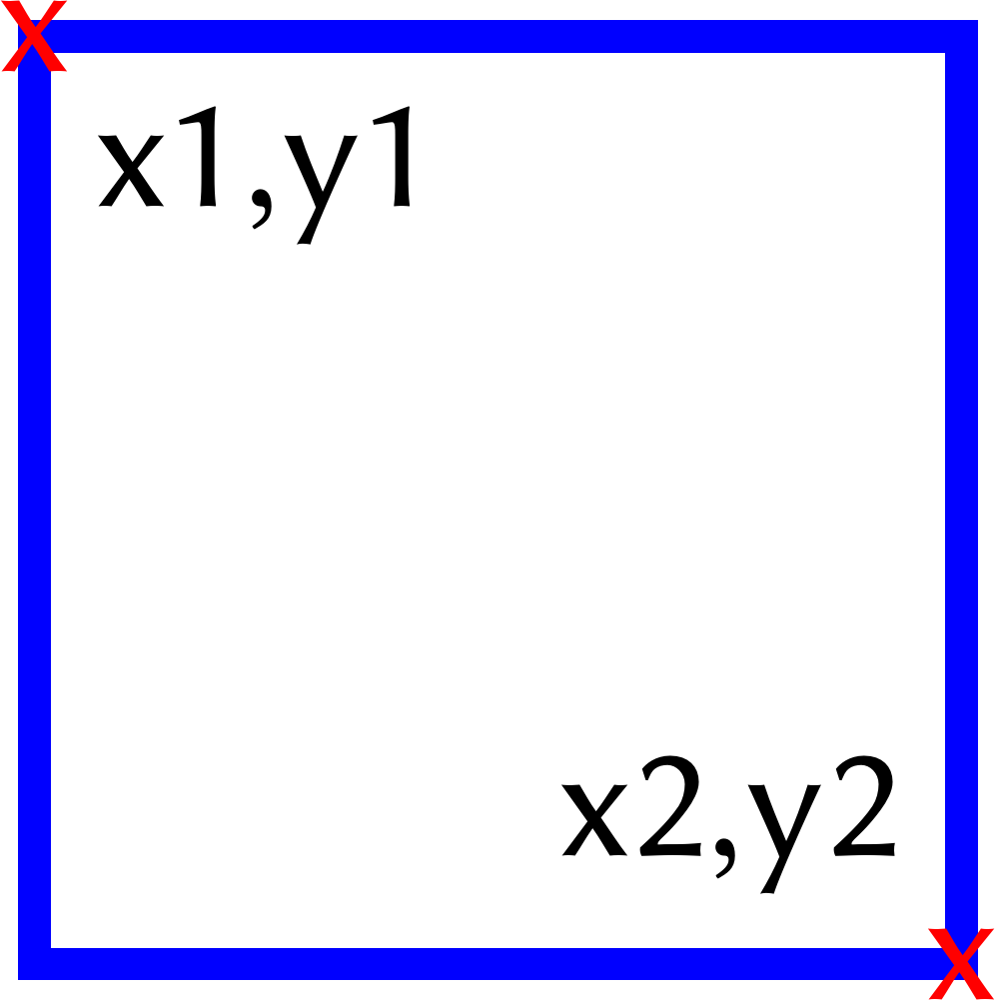
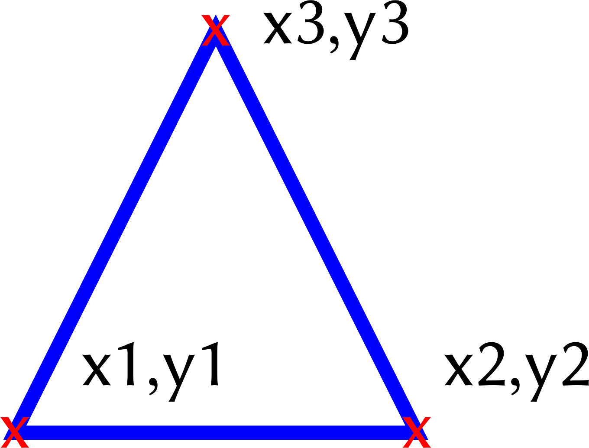

ASPECT Language
+++++++++++++++

ASPECT is declarative sub-language of ASP that can be used to define the graphical representation of an answer set. 
ASPECT (:ref:`standard <standardModeAtoms>`) syntax consists of 21 special atomic formulas that define rendering of geometric primitives such as points, lines, polygons, ellipses, etc. 
The positioning of each element is determined by Cartesian coordinates.

The syntax of the ASPECT language is inspired by the popular PGF/TikZ language developed for drawing vector graphics in the markup language LaTeX.

A concise variant of the ASPECT language has been developed specifically for **graph visualization** (these are called :ref:`graph <graphModeAtoms>` atoms).
This variant allows the user to define graphical elements (e.g., nodes and edges) without the need to worry about specifying coordinates, 
which are instead handled and optimized by the TikZ package. This variant consist of 6 atoms. 

.. attention:: 
  The following two sets of ASPECT atoms (:ref:`standard <standardModeAtoms>` atoms and :ref:`graph <graphModeAtoms>` atoms) are incompatible 
  so they cannot be used in the same ASP program at the same time.

.. topic:: Animated graphics

  For certain problem types, each answer set represents a sequence of actions to be executed in order to achieve a goal starting from a defined initial state.
  In these problems, dynamic visualization through animation is especially valuable, providing insights into the transition from the initial state to the final state.
  In this regard, each atom in the ASPECT language supports an optional integer argument denoted by ``frame`` which represents the frame of the animation in which the graphical element should be inserted.
  
  .. hint:: 
    ASPECT atoms without the frame parameter will be inserted in all frames of the animation.

.. _standardModeAtoms:

Standard Drawing Atoms
-------------------------------

.. list-table::
   :widths: 1 5 3
   :header-rows: 1

   * - | Graphic 
       | element
     - | ASPECT 
       | atoms
     - |  
       | 
   * - node 
     - | ``aspect_drawnode(x1,y1,text,[attributes],[frame])``
       | ``aspect_imagenode(x1,y1,image,[attributes],[frame])``
     - | ``x1`` x-coordinate
       | ``y1`` y-coordinate
       | ``text`` set the node label
       | ``image`` path of image
       | ``attributes`` (opt.) attributes list
       | ``frame`` (opt.) frame number

.. _colorDescription:

* ``text``:  quoted or unquoted text. **If text contains whitespaces or special characters, quotation marks are mandatory**.
* ``image``:  the file path to the image.
* ``attributes``: (optional) a single attribute, or a tuple ``(att1, att2, …)``. See :doc:`ASPECT attributes <attributes>` for details.
* ``frame``: (optional) integer number representing the frame of the animation in which the graphical element should be inserted.

.. list-table::
   :widths: 1 6 2

   * - line
     - | ``aspect_line(x1,y1,x2,y2,[attributes],[frame])``
       |
       | ``x1`` start point x-coordinate
       | ``y1`` start point y-coordinate
       | ``x2`` end point x-coordinate
       | ``y2`` end point y-coordinate
       | ``attributes`` (opt.) attributes list
       | ``frame`` (opt.) frame number
     - | |line|
   * - arc
     - | ``aspect_arc(x1,y1,a1,a2,r1,[attributes],[frame])``
       |
       | ``x1`` x-coordinate of the center
       | ``y1`` y-coordinate of the center
       | ``a1`` start angle
       | ``a2`` end angle
       | ``r1`` radius
       | ``attributes`` (opt.) attributes list  
       | ``frame`` (opt.) frame number
     - | |arc|
   * - | straight 
       | arrow
     - | ``aspect_arrow(x1,y1,x2,y2,[attributes],[frame])``
       | 
       | ``x1`` tail x-coordinate
       | ``y1`` tail y-coordinate
       | ``x2`` tip x-coordinate
       | ``y2`` tip y-coordinate
       | ``attributes`` (opt.) attributes list  
       | ``frame`` (opt.) frame number
     - | |arrow|
   * - | square / 
       | rectangle
     - | ``aspect_rectangle(x1,y1,x2,y2,[attributes],[frame])``
       | 
       | ``x1`` first corner x-coordinate
       | ``y1`` first corner y-coordinate
       | ``x2`` second corner x-coord
       | ``y2`` second corner y-coord
       | ``attributes`` (opt.) attributes list  
       | ``frame`` (opt.) frame number
     - | |square|
   * - | triangle
     - | ``aspect_triangle(x1,y1,x2,y2,x3,y3,[attributes],[frame])``
       |
       | ``x1`` first vertex x-coordinate
       | ``y1`` first vertex y-coordinate
       | ``x2`` second vertex x-coord
       | ``y2`` second vertex y-coord
       | ``x3`` third vertex x-coord
       | ``y3`` third vertex y-coord
       | ``attributes`` (opt.) attributes list
       | ``frame`` (opt.) frame number
     - | |triangle|
   * - | circle
     - | ``aspect_circle(x1,y1,r1,[attributes],[frame])``
       |
       | ``x1`` center x-coordinate
       | ``y1`` center y-coordinate
       | ``r1`` radius
       | ``attributes`` (opt.) attributes list
       | ``frame`` (opt.) frame number  
     - | |circle|
   * - | ellipse
     - | ``aspect_ellipse(x1,y1,r1,r2,[attributes],[frame])``
       |
       | ``x1`` center x-coordinate
       | ``y1`` center y-coordinate
       | ``r1`` x radius
       | ``r2`` y radius
       | ``attributes`` (opt.) attributes list
       | ``frame`` (opt.) frame number
     - | |ellipse|

.. _graphModeAtoms:

Graph Drawing Atoms
---------------------------------

.. attention:: 
  The two sets of ASPECT atoms (:ref:`standard <standardModeAtoms>` atoms and :ref:`graph <graphModeAtoms>` atoms) are incompatible 
  so they cannot be used in the same ASP program at the same time.

.. list-table::
   :widths: 20 53 31
   :header-rows: 1

   * - | Graphic 
       | element
     - | ASPECT 
       | atoms
     - | Parameters 
       | description
   * - node 
     - | ``aspect_graphdrawnode(A,[shape],[frame])``
       | ``aspect_graphcolornode(A,fill,[shape],[frame])``
     - | ``A`` node label (name)
       | ``shape`` (opt.) node shape 
       | ``fill`` sets fill :ref:`color <colorDescription>`

* ``shape``:  allows to choose the ``circle`` shape for the node. By default nodes are represented by squares.

.. hint::
  * ``aspect_graphdrawnode(1)`` a square-shaped node.
  * ``aspect_graphdrawnode(2, circle)`` a circular-shaped node.

.. list-table::
   :widths: 20 53 31

   * - edge  
     - | ``aspect_graphdrawline(A,B,[frame])``
       | ``aspect_graphquoteline(A,B,text,[frame])``
     - | ``A`` name first endpoint
       | ``B`` name second endpoint
       | ``text`` sets edge label
   * - arrow  
     - | ``aspect_graphdrawarrow(A,B,[frame])``
       | ``aspect_graphquotearrow(A,B,text,[frame])``
     - | ``A`` name arrow tail
       | ``B`` name arrow tip
       | ``text`` sets edge label

* ``text``:  quoted or unquoted text. **If text contains whitespaces or special characters, quotation marks are mandatory**.